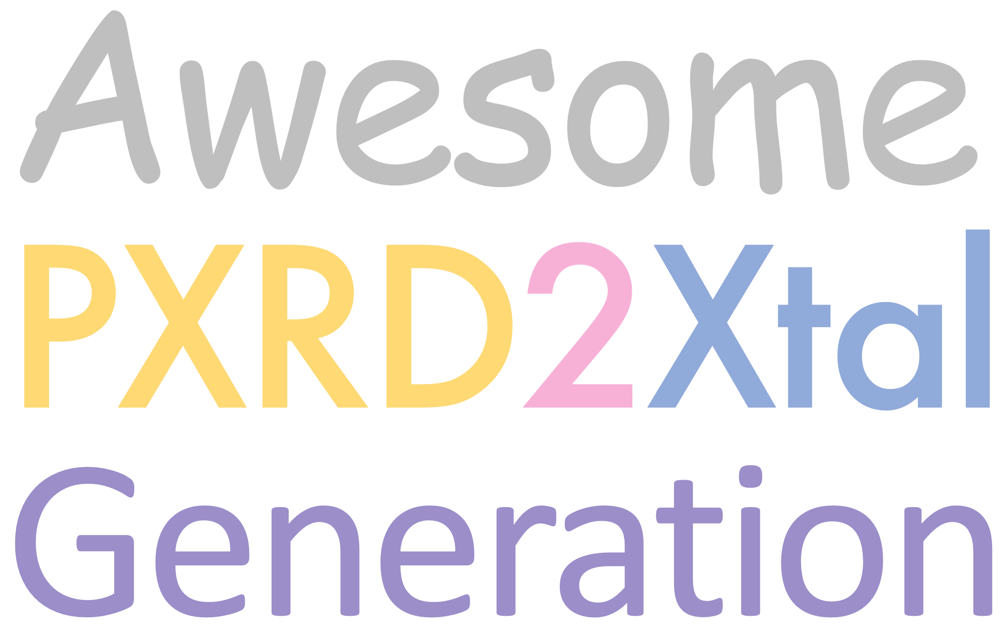

#

Powder X-ray diffraction (PXRD) structure determination is an ill-posed inverse problem traditionally addressed through indexing and Rietveld refinement. Recent generative models offer a revolutionary approach by directly mapping 1D diffraction patterns to 3D crystal structures. This repository curates open-source models and related resources for the PXRD to crystal structure generation task.

## AI-assisted Curation

This repository adopts a new "AI-assisted" approach to content creation, hoping to overcome the limitations of traditional human-based research information collection. We will employ advanced reasoning models and AI research tools to generate comprehensive content, followed by careful human review and refinement. All AI-generated responses, procedures, and modifications will be documented in a transparent protocol along with each update.

## Beyond Curation

Unlike typical "awesome" repositories that merely list resources, we try to solve the "last mile delivery" issue by providing inference scripts. Currently some tested inference scripts are available for selected models in the `inference` folder:

| Model | Local Inference | Cloud Inference | Utils/Support | Environment |
|-------|-----------------|-----------------|---------------|-------------|
| **Uni3DAR** | `uni3dar_inference.py` | `uni3dar_modal.py` | N/A | `uni3dar_env.yml` |
| **PXRDnet** | `pxrdnet_inference.py` | `pxrdnet_modal.py` | N/A | `pxrdnet_env.yml` |
| **deCIFer** | `decifer_inference.py` | N/A | `decifer_utils.py` | `decifer_env.yml` |
| **Crystalyze** | `crystalyze_inference.py` | N/A | `crystalyze_utils.py` | `crystalyze_env.yml` |
| **DiffractGPT** | `diffractgpt_inference.py` | `diffractgpt_modal.py` |  N/A |  N/A |

Additionally, `parse_cifs.py` in the `utils` folder provides general utilities for parsing and processing CIF files that contains experimental PXRD patterns across different models. We are planning to add more utility scripts in the future. Besides, we are investigating using latest automatic coding agents to update/develop those inference scripts automatically.

## Models

| Model           | Year | Method / Architecture                               | Reported Performance†            | Paper                                             | Implementation                                                 |
| --------------- | ---- | --------------------------------------------------- | -------------------------------- | ------------------------------------------------- | -------------------------------------------------------------- |
| **DeepStruc**   | 2023 | Conditional VAE on PDF data                         | Correct for 7 nanoparticle types | [*Digit. Discov.*](https://pubs.rsc.org/en/content/articlelanding/2023/dd/d2dd00086e)                      | [EmilSkaaning/DeepStruc](https://github.com/EmilSkaaning/DeepStruc)            |
| **CrystalNet**  | 2024 | Coord-based VAE → electron density                  | ≳ 93 % SSIM (cubic/trigonal)     | [*npj Comput. Mater.*](https://www.nature.com/articles/s41524-024-01401-8)                | [gabeguo/deep-crystallography-public](https://github.com/gabeguo/deep-crystallography-public) |
| **Crystalyze**  | 2024 | End-to-end PXRD→CIF pipeline                        | 42 % (exp); 67 % (sim)           | [*JACS*](https://pubs.acs.org/doi/abs/10.1021/jacs.4c10244)                          | [ML-PXRD/Crystalyze](https://github.com/ML-PXRD/Crystalyze)                                                              |
| **PXRDnet**     | 2024 | SE(3) score-based diffusion                         | ≤ 0.11 Å median RMSD             | [*Nat. Mater.*](https://www.nature.com/articles/s41563-025-02220-y)                                  | [cgabeguo/cdvae_xrd](https://github.com/gabeguo/cdvae_xrd)             |
| **PXRDGen**     | 2024 | Diffusion/Flow + auto-Rietveld                      | 96 % top-20 (MP-20)              | [*Nat. Comm.*](https://www.nature.com/articles/s41467-025-62708-8)                                  | [10.24433/CO.6347299.v1](https://codeocean.com/capsule/7727770/tree/v1)                                                              |
| **XtalNet**     | 2024 | CPCP + conditional diffusion                        | 90 % (top-10, hMOF-100)          | [*Adv. Sci.*](https://advanced.onlinelibrary.wiley.com/doi/full/10.1002/advs.202410722) | [10.5281/zenodo.13629658](https://zenodo.org/records/13629658)                                                              |
| **deCIFer**     | 2025 | Autoregressive Transformer                          | 94 % structure match             | [arXiv](https://arxiv.org/abs/2502.02189)                                  | [FrederikLizakJohansen/deCIFer](https://github.com/FrederikLizakJohansen/deCIFer)     |
| **DiffractGPT** | 2025 | Large-token GPT (PXRD-conditioned)                  | 0.28 Å lattice-MAE               | [*J. Phys. Chem. Lett.*](https://pubs.acs.org/doi/full/10.1021/acs.jpclett.4c03137)             | [usnistgov/atomgpt](https://github.com/usnistgov/atomgpt)      |
| **Uni3DAR** | 2025 | Hierarchical tokenization 3D autoregressive                  | 0.02 RMSE               | [arXiv](https://arxiv.org/abs/2503.16278)             | [dptech-corp/Uni-3DAR](https://github.com/dptech-corp/Uni-3DAR)      |

†As reported by authors; metrics differ across papers.

## Datasets

| Dataset                                                                                          | Size      | Sim / Exp | Format         | Notes                                |
| ------------------------------------------------------------------------------------------------ | --------- | --------- | -------------- | ------------------------------------ |
| **[hMOF-100 / 400](https://doi.org/10.5281/zenodo.13629658)**                   | 100 / 400 | Sim       | CIF + PXRD     | Large hypothetical MOFs              |
| **[Perov-5](https://figshare.com/articles/dataset/Perov5/22705189)**          | ≈ 1–3k   | Sim       | CIF + PXRD     | Small-cell ABO3 benchmark |
| **[Carbon-24](https://huggingface.co/datasets/albertvillanova/carbon_24)**  | ≈ 6k     | Sim       | CIF + PXRD     | Covalent carbon allotropes           |
| **[MP-20-PXRD](https://github.com/gabeguo/cdvae_xrd/tree/main/data/mp_20)**     | 45 229    | Sim       | CIF + tensors  | Used by PXRDnet / PXRDGen            |
| **[JARVIS-DFT XRD](https://jarvis.nist.gov/)**                             | 20–60k   | Sim       | DB / API       | Broad chemistry; GPT pre-training    |
| **[CHILI-3K / 100K](https://github.com/UlrikFriisJensen/CHILI)** | 100k + | Sim | CIF + PXRD | Used by deCIFer |
| **[SimXRD-4M](https://openreview.net/forum?id=mkuB677eMM)**                 | 4.06M    | Sim       | Spectra shards | Crystal-symmetry mega-benchmark      |
| **[PowBase](http://www.cristal.org/powbase/index.html)**                 | 169    | Exp       | .dat/.cif |  Unlabeled experimental PXRD      |
| **[Crystallography Open Database](https://www.crystallography.net/cod/)**                 | 1,052    | Exp       | CIF + PXRD | Labeled with full structure information      |
| **[RRUFF](https://rruff.info/)** | 3k + | Exp | DB | Reference minerals|
| **[XRed](https://github.com/WPEM/XRED)**                                        | ≈ 2k     | Exp       | .xy            | High-quality mineral patterns        |
| **[opXRD](https://zenodo.org/records/15298026)**                 | 92,552    | Exp       | .xyz | Sourced from multiple research institutes      |

## Metrics

| Metric                            | Script / Ref                                                                                                                    | Typical “good” value |
| --------------------------------- | ------------------------------------------------------------------------------------------------------------------------------- | -------------------- |
| **Top-k structure match**         | [`compute_ccsg_metrics.py`](https://github.com/dptech-corp/XtalNet/blob/main/scripts/compute_ccsg_metrics.py) | ≥ 90 % (k ≤ 10)      |
| **Atomic RMSD (Å)**               | Evaluation scripts in [`cdvae_xrd/scripts`](https://github.com/gabeguo/cdvae_xrd/tree/main/scripts)            | ≤ 0.1 Å              |
| **Pattern SSIM / correlation**    | Deep-density method (Guo *et al.* 2024)                                                                        | ≥ 0.9                |
| **Rwp after Rietveld** | Auto-refinement step in PXRDnet pipeline                                                                       | ≤ 10 %               |
| **Space-group accuracy**          | SimXRD-4M leaderboard                                                                                      | ≥ 90 %               |
| **Wasserstein distance**          | custom / model-specific                                                                                                         | model-specific       |