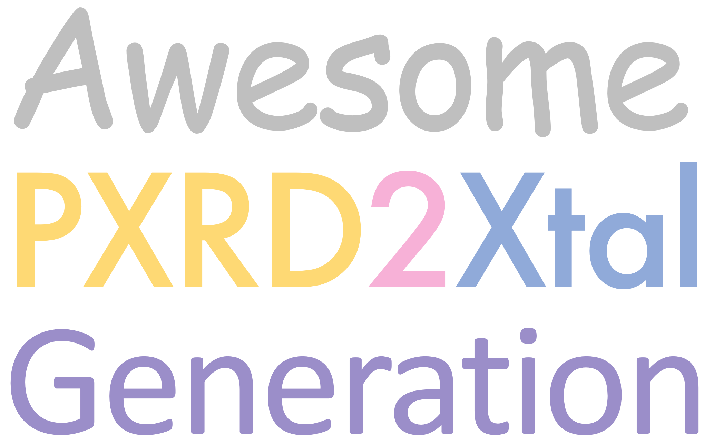

A curated, AI-assisted index of resources for **powder X-ray diffraction (PXRD) to crystal structure determination/generation**. The emphasis is on methods that use machine learning, generative modeling, differentiable refinement, or high-throughput simulated/experimental PXRD data to infer crystal structures from 1D diffraction patterns.

PXRD structure determination is an ill-posed inverse problem: many candidate structures can produce similar patterns, experimental profiles contain instrumental broadening, finite-size effects, texture, preferred orientation, background, impurity phases, and peak overlap, and many workflows require prior knowledge such as composition, lattice constants, or a unit cell. Traditional approaches rely on indexing, search-match, direct methods/global optimization, and Rietveld refinement. Recent AI/ML methods add new capabilities, including direct PXRD-to-CIF generation, diffusion or flow-based coordinate sampling, language-model generation of CIF text, lattice/symmetry prediction, retrieval/search-match, and phase decomposition.

**Last update:** 2026-05-09. See [`curation_protocal.md`](curation_protocal.md) for the AI-assisted curation workflow and update notes.

**Interactive board:** Explore and filter the catalog at [nodeology.ai/resources/pxrd2xtal](https://nodeology.ai/resources/pxrd2xtal).

## Scope and Taxonomy

This repository separates methods into two groups:

1. **Core PXRD → structure generation / solution methods**: models that aim to generate or solve full crystal structures, usually CIF-like outputs or atomic coordinates/lattices, from PXRD plus optional side information such as composition, formula, unit cell, or lattice parameters.
2. **Related PXRD AI/ML modules**: methods that do not by themselves output a complete structure, but are useful for structure solution pipelines, including lattice/space-group prediction, retrieval/search-match, multi-phase decomposition, Rietveld refinement, simulation acceleration, and experimental-data benchmarks.

The tables below intentionally mix peer-reviewed articles, preprints, open repositories, and datasets. Author-reported metrics are **not directly comparable** because input assumptions, chemistry scope, crystallographic tolerances, simulated-vs-experimental evaluation, and post-refinement protocols differ.

## AI-assisted Curation

This repository adopts an **AI-assisted curation** approach: advanced reasoning models and web research tools are used to discover and organize resources, followed by human review. The goal is to overcome the limitations of manual literature tracking while keeping the process auditable. All AI-generated update passes, corrections, and known uncertainties are documented in [`curation_protocal.md`](curation_protocal.md).

The resource tables below are generated from the canonical [`data/resources.json`](data/resources.json) catalog. Run `python3 scripts/catalog.py render` after catalog edits and `python3 scripts/catalog.py check` before submitting a pull request.

## Core PXRD → Structure Generation / Structure Solution Models

<!-- BEGIN GENERATED: core-solvers -->
| Model | Year | Inputs / Target | Method / Architecture | Reported Performance† | Paper | Implementation / Data |
|-------|------|-----------------|-----------------------|------------------------|-------|-----------------------|
| **DeepStruc** | 2023 | Pair distribution function / scattering data → nanoparticle structure class | Conditional VAE on PDF-like data | Correct for 7 nanoparticle types | [Digital Discovery](https://pubs.rsc.org/en/content/articlelanding/2023/dd/d2dd00086e) | [EmilSkaaning/DeepStruc](https://github.com/EmilSkaaning/DeepStruc) |
| **CrystalNet** | 2024 | PXRD + composition information → electron density / structure | Coordinate-based VAE for electron density | Up to 93.4% SSIM on cubic test cases; 74.1% average SSIM on trigonal cases | [npj Computational Materials](https://www.nature.com/articles/s41524-024-01401-8) | [gabeguo/deep-crystallography-public](https://github.com/gabeguo/deep-crystallography-public) |
| **Crystalyze** | 2024 | PXRD → CIF / crystal structure | End-to-end PXRD-to-CIF pipeline | 42% experimental match; 67% simulated match | [JACS](https://pubs.acs.org/doi/abs/10.1021/jacs.4c10244) | [ML-PXRD/Crystalyze](https://github.com/ML-PXRD/Crystalyze) |
| **XtalNet** | 2024/2025 | PXRD + composition / MOF setting → crystal structure candidates | Crystal-parameter-constrained prediction + conditional diffusion | 90% top-10 on hMOF-100 | [Advanced Science](https://advanced.onlinelibrary.wiley.com/doi/full/10.1002/advs.202410722) | [Zenodo: hMOF-100/400 + code/data](https://zenodo.org/records/13629658) |
| **PXRDnet** | 2025 | Formula + finite-size-broadened PXRD → atomic structure candidates | SE(3)-equivariant score-based diffusion; post-Rietveld verification | Verifiable candidates for simulated nanocrystals in ~4/5 cases; average post-Rietveld R factor ~7%; median RMSD ≤0.11 Å in reported benchmarks | [Nature Materials](https://www.nature.com/articles/s41563-025-02220-y) | [gabeguo/cdvae_xrd](https://github.com/gabeguo/cdvae_xrd) |
| **PXRDGen** | 2025 | PXRD + optional composition constraints → structure candidates | Pretrained XRD encoder + diffusion/flow generator + automatic Rietveld refinement | MP-20: 82% valid compounds from 1 sample; 96% within 20 samples | [Nature Communications](https://www.nature.com/articles/s41467-025-62708-8) | [CodeOcean capsule](https://codeocean.com/capsule/7727770/tree/v1) |
| **deCIFer** | 2025/2026 | PXRD-conditioned generation → CIF tokens | Autoregressive Transformer / CIF language modeling | 94% structure match in author-reported setting | [TMLR / OpenReview](https://openreview.net/forum?id=LftFQ35l47) | [FrederikLizakJohansen/deCIFer](https://github.com/FrederikLizakJohansen/deCIFer) |
| **DiffractGPT** | 2025 | PXRD-conditioned text generation → CIF-like crystal descriptions | Large-token GPT / AtomGPT-style generative model | DGPT-formula lattice MAE: 0.17 / 0.18 / 0.27 Å for a/b/c; normalized RMS-d 0.07 Å | [J. Phys. Chem. Lett.](https://pubs.acs.org/doi/full/10.1021/acs.jpclett.4c03137) | [atomgptlab/atomgpt](https://github.com/atomgptlab/atomgpt) |
| **Uni3DAR** | 2025 | PXRD + composition tokens → 3D crystal generation | Hierarchical tokenization + 3D autoregressive generation | MP-20 PXRD-guided CSP: 75.08% match rate, 0.0276 RMSE | [arXiv](https://arxiv.org/abs/2503.16278) | [dptech-corp/Uni-3DAR](https://github.com/dptech-corp/Uni-3DAR) |
| **XRDSol** | 2026 | Stoichiometry + unit cell + PXRD → atomic coordinates | Equivariant graph neural network diffusion model | MP-20: 82.3% success; ICDD-20 experimental benchmark: 81.6%; ~0.6 s per solution on one GPU | [Nature Communications](https://www.nature.com/articles/s41467-026-70035-9) | [ai4mat-zhu/XRDSol](https://github.com/ai4mat-zhu/XRDSol), [Zenodo code/data](https://doi.org/10.5281/zenodo.17837824) |
| **RealPXRD-Solver** | 2026 | Experimental or simulated PXRD, with lattice-conditioned and lattice-free modes → crystal structure | Flow-matching / generative solver using d-I fingerprints and experiment-mimicking augmentation | Theoretical benchmark: 98.3% top-20; CNRS experimental: 77.9% top-1 / 91.9% top-20 with lattice conditioning; RRUFF: 78.8% / 92.9%; solved 39 previously unreported PDF entries | [arXiv](https://arxiv.org/abs/2603.00965) | [liqi-529/RealPXRD-Solver](https://github.com/liqi-529/RealPXRD-Solver) |
<!-- END GENERATED: core-solvers -->

†Author-reported metrics; evaluation tasks and assumptions differ. Check each paper for allowed inputs, structural tolerances, train/test chemistry overlap, post-refinement settings, and experimental validation protocol.

## Related PXRD AI/ML Modules

These methods are not always full PXRD-to-structure generators, but they are highly relevant to practical PXRD structure determination pipelines.

<!-- BEGIN GENERATED: pipeline-modules -->
| Resource | Year | Task | Method | Reported Result / Note | Paper | Code / Data |
|----------|------|------|--------|------------------------|-------|-------------|
| **AlphaDiffract** | 2026 | Crystal system, space group, and lattice parameter prediction from PXRD | 1D ConvNeXt / deep diffraction encoder | Trained on >31M simulated patterns from 312,267 ICSD + Materials Project structures; RRUFF experimental benchmark: 81.7% crystal-system and 66.2% space-group accuracy in the paper | [arXiv](https://arxiv.org/abs/2603.23367) | [Open model](https://huggingface.co/linked-liszt/OpenAlphaDiffract), [training code](https://github.com/AdvancedPhotonSource/OpenAlphaDiffract) |
| **XQueryer** | 2025 | Neural search-match / structure identification from PXRD | Fourier transform, CNN feature extraction, cross-attention, real-time diffractometer integration | Simulated database: >2M patterns from 100,315 Materials Project structures; experimental RRUFF-MP benchmark: ~70.3% accuracy reported | [National Science Review](https://academic.oup.com/nsr/article/12/12/nwaf421/8268901) | [Bin-Cao/XQueryer](https://github.com/Bin-Cao/XQueryer) |
| **XCCP** | 2026 | Contrastive PXRD-candidate matching and space-group identification | Dual-expert PXRD/candidate encoder with Kolmogorov-Arnold Network components | Top-1 structure retrieval: 46.42% without elemental priors; 88.98% with elemental pre-screening; space-group accuracy up to 93.39% with composition filtering | [npj Computational Materials](https://www.nature.com/articles/s41524-026-02015-y) | [opXRD-HKUST experimental data](https://huggingface.co/datasets/caobin/opxrd_hkust_expdata), code not found during 2026-05-09 pass |
| **PhaseDifformer** | 2026 | Multi-phase PXRD decomposition | Phase-decomposition diffusion Transformer | Decomposes a single mixed PXRD pattern into constituent single-phase patterns; useful as a front-end for mixture analysis before structure solution | [npj Computational Materials](https://www.nature.com/articles/s41524-026-02087-w) | Code/data not found during 2026-05-09 pass |
| **Automation of Rietveld refinement through machine learning** | 2026 | Fast Rietveld-like refinement / parameter prediction | Convolutional neural network trained on simulated PXRD profiles | Demonstrated refined structures for CeO₂, Tb₂BaCoO₅, and PbSO₄ with reliability factors comparable to conventional Rietveld refinement | [Journal of Applied Crystallography / ORA](https://ora.ox.ac.uk/objects/uuid:f25209eb-c034-4ef5-9056-6cab8cf303d1) | Article-provided workflow; standalone code not found during 2026-05-09 pass |
<!-- END GENERATED: pipeline-modules -->

## Datasets and Benchmarks

<!-- BEGIN GENERATED: datasets -->
| Dataset / Benchmark | Size | Sim / Exp | Format | Notes / Use | Link |
|---------------------|------|-----------|--------|-------------|------|
| **hMOF-100 / hMOF-400** | 100 / 400 | Sim | CIF + PXRD | Hypothetical MOF benchmarks used by XtalNet | [Zenodo](https://doi.org/10.5281/zenodo.13629658) |
| **Perov-5** | 18,928 | Sim | Structure data; PXRD can be simulated | Small-cell ABO₃ / perovskite benchmark with 5 atoms per unit cell | [Figshare](https://figshare.com/articles/dataset/Perov5/22705189) |
| **Carbon-24** | 10,153 | Sim | Structure data; PXRD can be simulated | Carbon allotrope benchmark with 6–24 atoms per unit cell | [Hugging Face](https://huggingface.co/datasets/albertvillanova/carbon_24) |
| **MP-20-PXRD** | 45,229 | Sim | CIF + tensors / calculated PXRD | Materials Project subset used by PXRDnet and PXRDGen | [gabeguo/cdvae_xrd data](https://github.com/gabeguo/cdvae_xrd/tree/main/data/mp_20) |
| **XRDSol MP-20 / ICDD-20 benchmarks** | 45,231 MP structures; 1,000 experimental ICDD-20 sets | Sim + Exp | CIF/PXRD; some restricted experimental records | XRDSol training/evaluation; ICDD/PDF content may require database access | [XRDSol GitHub](https://github.com/ai4mat-zhu/XRDSol) |
| **JARVIS-DFT / JARVIS-XRD** | 80k+ materials in JARVIS-DFT | Sim | DB / API / web app | Broad inorganic computed structures and simulated XRD; DiffractGPT reports training from JARVIS-DFT simulated PXRD | [JARVIS docs](https://pages.nist.gov/jarvis/), [XRD tool docs](https://jarvis-tools.readthedocs.io/en/master/autoapi/jarvis/analysis/diffraction/xrd/) |
| **CHILI-3K / CHILI-100K** | 3K / 100K nanomaterial graphs | Sim | Graph/HDF5 nanomaterial data with structure and scattering-related targets | Related large-scale inorganic nanomaterial benchmark; not a direct PXRD-to-CIF benchmark | [CHILI GitHub](https://github.com/UlrikFriisJensen/CHILI) |
| **SimXRD-4M** | 4,065,346 patterns from 119,569 structures | Sim | Spectra shards | Large crystal-symmetry prediction benchmark with 33 simulated conditions | [OpenReview](https://openreview.net/forum?id=mkuB677eMM) |
| **SIMPOD** | 467,861 | Sim | JSON structures, 1D PXRD, 2D radial images | COD-derived benchmark for PXRD ML; simulated 2θ range 5–90° with 10,824 points and radial-image representation | [Scientific Data paper](https://www.nature.com/articles/s41597-025-05534-3), [GitHub](https://github.com/BCV-Uniandes/SIMPOD) |
| **RealPXRD-Solver training corpus** | 6,250,238 theoretical structures | Sim + Exp evaluation | d-I fingerprints, simulated/augmented PXRD, code/data links | AFLOW + Materials Project + Alexandria + OQMD-scale corpus with experiment-mimicking augmentations; evaluated on CNRS, RRUFF, and PDF entries | [arXiv](https://arxiv.org/abs/2603.00965), [GitHub](https://github.com/liqi-529/RealPXRD-Solver) |
| **AlphaDiffract simulation corpus** | >31M simulated PXRD from 312,267 structures in paper; open MP-only model subset also available | Sim + Exp evaluation | Simulated PXRD, labels for lattice / symmetry | Crystal system, space group, and lattice parameter benchmark; open model/data are smaller and based on public Materials Project structures | [arXiv](https://arxiv.org/abs/2603.23367), [Open model](https://huggingface.co/linked-liszt/OpenAlphaDiffract) |
| **XQueryer simulated database** | >2M PXRD patterns from 100,315 MP structures | Sim + Exp evaluation | Simulated patterns, matching database, benchmark scripts | Neural search-match and real-time identification; includes RRUFF-MP matching benchmark | [National Science Review paper](https://academic.oup.com/nsr/article/12/12/nwaf421/8268901), [GitHub](https://github.com/Bin-Cao/XQueryer) |
| **PowBase** | 169 | Exp | `.dat` / `.cif` | Historical experimental PXRD collection; limited labels | [PowBase archived snapshot](https://web.archive.org/web/20260510024719/https://www.cristal.org/DU-SDPD/nexus/albweb/univ-lem/powbase/index2.htm) |
| **Crystallography Open Database entries with diffraction data** | Query-dependent | Exp / structure DB | CIF; diffraction/profile fields where deposited | COD is primarily an open crystal-structure database; experimental diffraction availability depends on the individual CIF records | [COD](https://www.crystallography.net/cod/) |
| **RRUFF** | 1k+ XRD patterns | Exp | DB / spectra | Reference mineral Raman/IR/XRD data; commonly used for experimental transfer | [RRUFF](https://rruff.info/) |
| **XRed** | 100+ public pattern files in GitHub tree | Exp | `.csv` + `.cif` | Public experimental XRD phase-identification dataset with mono-, bi-, tri-, and multi-phase examples | [WPEM/XRED](https://github.com/WPEM/XRED) |
| **opXRD** | 92,552 patterns; 2,179 at least partially labeled | Exp | Diffractograms + metadata | Open experimental PXRD database sourced from six contributing institutions; useful for experimental-domain adaptation and retrieval | [Data portal](https://xrd.aimat.science/), [paper](https://publikationen.bibliothek.kit.edu/1000182521) |
| **opXRD-HKUST / XCCP experimental data** | subset of opXRD-related experimental data | Exp | Hugging Face dataset | Experimental data associated with contrastive PXRD-candidate matching | [Hugging Face](https://huggingface.co/datasets/caobin/opxrd_hkust_expdata) |
<!-- END GENERATED: datasets -->

## Metrics and Evaluation Recommendations

| Metric / Evaluation Axis | What it Measures | Typical Use / Caveat |
|--------------------------|------------------|----------------------|
| **Top-k structure match / recovery** | Whether a generated candidate matches the reference under a structure-matching tolerance | Common for generative solvers. Always report k, matcher tolerances, whether lattice/composition were supplied, and whether Rietveld/post-relaxation was used. |
| **StructureMatcher fit / site-wise MaxDist** | Crystallographic equivalence under symmetry, lattice scaling, and site matching | More robust than raw coordinate error, but tolerance choices can strongly affect success rates. |
| **Atomic RMSD / sRMS / coordinate error** | Continuous deviation between predicted and reference atomic positions after matching | Useful for near-miss ranking. Report whether structures were symmetrized, Niggli-reduced, refined, or relaxed. |
| **Lattice MAE / unit-cell error** | Error in a, b, c, α, β, γ or derived cell volume | Needed for lattice-free solvers and lattice predictors such as AlphaDiffract. |
| **Crystal-system and space-group accuracy** | Classification quality for symmetry labels | Useful for indexing and downstream candidate restriction. Report exact space-group accuracy separately from crystal-system accuracy. |
| **PXRD profile similarity** | Similarity between observed and predicted/calculated patterns | Metrics include Pearson correlation, cosine similarity/Rcos, SSIM for image-like profiles, Wasserstein distance, and peak-overlap scores. These can be misleading when many structures share similar peaks. |
| **Rietveld reliability factors** | Agreement after refinement | Common outputs include Rwp, Rp, Rexp, goodness-of-fit χ², and residual plots. Report background, preferred orientation, peak shape, and refinement constraints. |
| **Retrieval top-k hit rate / MRR / confidence** | Whether the correct candidate appears among top-k search-match results | Used by neural search-match methods such as XQueryer and XCCP. Include open-set rejection, candidate database size, and composition-filter assumptions. |
| **Experimental transfer** | Performance on real measured data rather than simulated profiles | Report benchmark source: RRUFF, CNRS, ICDD/PDF, COD, opXRD, XRed, or in-house. Separate truly held-out experimental patterns from synthetic perturbations. |
| **Robustness to experimental artifacts** | Sensitivity to noise, background, peak broadening, 2θ range, preferred orientation, impurity phases, and scanning step | Essential for comparing simulated-training methods. RealPXRD-Solver-style augmentation makes these axes explicit. |
| **Chemical/crystallographic scope** | Generalization across elements, formula sizes, cell sizes, symmetry groups, and organic/inorganic/MOF domains | Many impressive metrics apply only to MP-20-like inorganic cells, selected MOFs, minerals, or small cells. |
| **Compute / throughput** | Seconds per structure, GPU/CPU requirements, batch size, simulation speed | Important for high-throughput candidate generation. XRDSol reports sub-second GPU solutions; XRD-Rust accelerates PXRD simulation for dataset generation. |
| **Validity / uniqueness / novelty / coverage** | Whether generated CIFs are parseable, chemically valid, non-duplicate, and diverse | Borrowed from broader crystal-generation evaluation. Must be combined with pattern agreement and structure matching for PXRD tasks. |

A practical leaderboard should split at least the following settings:

- **Lattice-conditioned vs lattice-free** solution.
- **Composition-known vs composition-free** solution.
- **Single-phase vs multi-phase** patterns.
- **Simulated vs experimental** test data.
- **Closed-set retrieval vs open-set generation**.
- **No post-processing vs post-Rietveld/refinement**.

## Simulation, Refinement, and Utility Tools

<!-- BEGIN GENERATED: utilities -->
| Tool | Task | Notes | Link |
|------|------|-------|------|
| **pymatgen XRDCalculator** | PXRD simulation from CIF / structure | Widely used baseline for simulated pattern generation | [pymatgen](https://pymatgen.org/) |
| **GSAS-II** | Rietveld refinement and diffraction analysis | Standard open-source crystallographic refinement package; also used for simulation in ML data generation | [GSAS-II](https://cai.xray.aps.anl.gov/Featured-Projects/GSAS-II) |
| **XRD-Rust** | Fast PXRD simulation | Rust-accelerated pymatgen-style XRD calculator; reported average 4–6× speedups and much larger speedups for some structures | [PyPI](https://pypi.org/project/xrd-rust/), [GitHub](https://github.com/bracerino/xrd-rust) |
| **diffpy / PDF tools** | Pair distribution function analysis | Useful for PDF-based inverse problems and nanoparticle structure models | [diffpy](https://www.diffpy.org/) |
| **parse_cifs.py** | Repository utility | Parses and normalizes CIFs / experimental PXRD fields for model-specific inference scripts | [`utils/parse_cifs.py`](utils/parse_cifs.py) |
<!-- END GENERATED: utilities -->

## Beyond Curation: Inference Scripts

Unlike typical "awesome" repositories that only list resources, this repository also tries to solve the "last-mile" problem by providing runnable inference scripts when practical. Current tested scripts are in the [`inference`](inference) folder.

<!-- BEGIN GENERATED: inference -->
| Model | Local Inference | Cloud Inference | Utils/Support | Environment |
|-------|-----------------|-----------------|---------------|-------------|
| **Uni3DAR** | [`uni3dar_inference.py`](inference/uni3dar/uni3dar_inference.py) | [`uni3dar_modal.py`](inference/uni3dar/uni3dar_modal.py) | N/A | [`uni3dar_env.yml`](inference/uni3dar/uni3dar_env.yml) |
| **PXRDnet** | [`pxrdnet_inference.py`](inference/pxrdnet/pxrdnet_inference.py) | [`pxrdnet_modal.py`](inference/pxrdnet/pxrdnet_modal.py) | N/A | [`pxrdnet_env.yml`](inference/pxrdnet/pxrdnet_env.yml) |
| **deCIFer** | [`decifer_inference.py`](inference/decifer/decifer_inference.py) | N/A | [`decifer_utils.py`](inference/decifer/decifer_utils.py) | [`decifer_env.yml`](inference/decifer/decifer_env.yml) |
| **Crystalyze** | [`crystalyze_inference.py`](inference/crystalyze/crystalyze_inference.py) | N/A | [`crystalyze_utils.py`](inference/crystalyze/crystalyze_utils.py) | [`crystalyze_env.yml`](inference/crystalyze/crystalyze_env.yml) |
| **DiffractGPT** | [`diffractgpt_inference.py`](inference/diffractgpt/diffractgpt_inference.py) | [`diffractgpt_modal.py`](inference/diffractgpt/diffractgpt_modal.py) | N/A | N/A |
<!-- END GENERATED: inference -->

`utils/parse_cifs.py` provides general utilities for parsing and processing CIF files that contain experimental PXRD patterns across different model formats. New 2025–2026 models such as XRDSol and RealPXRD-Solver have public repositories but are not yet integrated into the local inference folder.

## Contributing

When adding a new entry, please include:

1. Paper or preprint link.
2. Code, model weights, or reproducibility artifact if available.
3. Dataset source and license/access restrictions.
4. Required inputs: PXRD only, composition, formula, lattice, unit cell, space group, or candidate database.
5. Reported metrics and exact evaluation setting.
6. Whether the method solves a full structure or only a subtask such as symmetry, lattice, retrieval, simulation, refinement, or phase decomposition.
