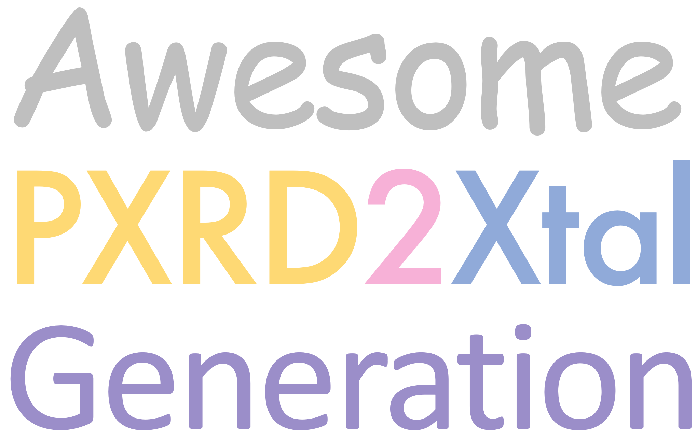

A curated, AI-assisted index of resources for **powder X-ray diffraction (PXRD) to crystal structure determination/generation**. The emphasis is on methods that use machine learning, generative modeling, differentiable refinement, or high-throughput simulated/experimental PXRD data to infer crystal structures from one-dimensional powder patterns or documented representations derived from them.

PXRD structure determination is an ill-posed inverse problem: many candidate structures can produce similar patterns, experimental profiles contain instrumental broadening, finite-size effects, texture, preferred orientation, background, impurity phases, and peak overlap, and many workflows require prior knowledge such as composition, lattice constants, or a unit cell. Traditional approaches rely on indexing, search-match, direct methods/global optimization, and Rietveld refinement. Recent AI/ML methods add new capabilities, including direct PXRD-to-CIF generation, diffusion or flow-based coordinate sampling, language-model generation of CIF text, lattice/symmetry prediction, retrieval/search-match, and phase decomposition.

**Last update:** 2026-10-05. See [`curation_protocal.md`](curation_protocal.md) for the AI-assisted curation workflow and update notes.

**Interactive board:** Explore and filter the catalog at [nodeology.ai/resources/pxrd2xtal](https://nodeology.ai/resources/pxrd2xtal).

## Scope and Taxonomy

Methods, datasets, and scientific tools are in scope only when a documented and evaluated pathway consumes, produces, or analyzes a one-dimensional powder X-ray diffraction profile, or a representation demonstrably derived from one, such as a peak list, d-I list, or Le Bail-extracted structure-factor amplitudes. A structure source may be retained as supporting substrate only when a named cataloged PXRD workflow directly uses it; the ability to calculate a pattern from an arbitrary CIF is not sufficient by itself.

The catalog records each resource's relationship to PXRD explicitly:

- **Direct PXRD**: the released workflow accepts, produces, or evaluates powder patterns.
- **Powder-derived input**: the user supplies a representation extracted from a powder pattern rather than the raw profile.
- **Multimodal with PXRD**: the resource also covers another measurement technique beyond PXRD, such as TEM, Raman, neutron diffraction, XPS, or EXAFS, but has an independently usable PXRD pathway.
- **Supporting substrate**: a structure source or generic tool directly used by named PXRD workflows; it is not itself a PXRD dataset or solver.

Pair distribution function/total-scattering methods, single-crystal and electron-diffraction methods, generic structure-generation benchmarks without a documented PXRD use, and literature-mining systems are outside the main catalog. They may be discussed in the curation record but are not counted as PXRD resources.

The repository separates retained records into four roles:

1. **Core PXRD → structure generation / solution methods**: models that aim to generate or solve full crystal structures, usually CIF-like outputs or atomic coordinates/lattices, from PXRD plus optional side information such as composition, formula, unit cell, or lattice parameters.
2. **Related PXRD AI/ML modules**: methods that do not by themselves output a complete structure, but are useful for structure solution pipelines, including lattice/space-group prediction, retrieval/search-match, multi-phase decomposition, Rietveld refinement, simulation acceleration, and experimental-data benchmarks.
3. **Datasets and benchmarks**: released simulated or experimental powder data, plus explicitly labeled supporting structure sources used by cataloged PXRD methods.
4. **Utilities**: simulation, refinement, conversion, and workflow tools with a documented PXRD pathway.

The tables below intentionally mix peer-reviewed articles, preprints, open repositories, and datasets. Author-reported metrics are **not directly comparable** because input assumptions, chemistry scope, crystallographic tolerances, simulated-vs-experimental evaluation, and post-refinement protocols differ.

### Choose the right starting point

| If you need to… | Start here | Check before comparing results |
|-----------------|------------|--------------------------------|
| Generate a full candidate structure | [Core solvers](#core-pxrd--structure-generation--structure-solution-models) | Whether formula, composition, lattice, unit cell, or space group is supplied |
| Identify a known phase or narrow the search space | [Pipeline modules](#related-pxrd-aiml-modules) | Candidate-database size, composition filtering, and open-set handling |
| Train or benchmark a model | [Datasets and benchmarks](#datasets-and-benchmarks) | Simulated vs experimental data, licensing, chemistry overlap, and leakage |
| Compare reported model quality | [Metrics and evaluation recommendations](#metrics-and-evaluation-recommendations) | Matcher tolerances, top-k, refinement, and experimental-transfer protocol |
| Run an included implementation | [Runnable inference](#runnable-inference) | The wrapper's status (`verified`, `reproduced`, or `limited`), required inputs, hardware, and upstream license |

The repository is more than a reading list: [`data/resources.json`](data/resources.json) is a validated, machine-readable source of truth; the README tables and [interactive Nodeology board](https://nodeology.ai/resources/pxrd2xtal) are derived from it; and the catalog distinguishes full solvers from supporting modules, datasets, utilities, and runnable inference.

## AI-assisted Curation

This repository adopts an **AI-assisted curation** approach: advanced reasoning models and web research tools are used to discover and organize resources, followed by human review. The goal is to overcome the limitations of manual literature tracking while keeping the process auditable. All AI-generated update passes, corrections, and known uncertainties are documented in [`curation_protocal.md`](curation_protocal.md). The runnable inference wrappers are built and benchmarked by AI agents following [`inference/AGENTS.md`](inference/AGENTS.md), reviewed independently by a second model against the upstream code, and logged in the same file.

The resource tables below are generated from the canonical [`data/resources.json`](data/resources.json) catalog. Run `python3 scripts/catalog.py render` after catalog edits and `python3 scripts/catalog.py check` before submitting a pull request.

## Core PXRD → Structure Generation / Structure Solution Models

<!-- BEGIN GENERATED: core-solvers -->
| Model | Scope | Year | Inputs / Target | Method / Architecture | Reported Performance† | Paper | Implementation / Data |
|-------|-------|------|-----------------|-----------------------|------------------------|-------|-----------------------|
| **CrystalNet** | Direct PXRD | 2024 | PXRD + composition information → electron density / structure | Coordinate-based VAE for electron density | Up to 93.4% SSIM on cubic test cases; 74.1% average SSIM on trigonal cases | [npj Computational Materials](https://www.nature.com/articles/s41524-024-01401-8) | [gabeguo/deep-crystallography-public](https://github.com/gabeguo/deep-crystallography-public) |
| **Crystalyze** | Direct PXRD | 2024 | PXRD → CIF / crystal structure | End-to-end PXRD-to-CIF pipeline | 42% experimental match; 67% simulated match | [JACS](https://pubs.acs.org/doi/abs/10.1021/jacs.4c10244) | [ML-PXRD/Crystalyze](https://github.com/ML-PXRD/Crystalyze) |
| **XtalNet** | Direct PXRD | 2024/2025 | PXRD + composition / MOF setting → crystal structure candidates | Contrastive PXRD-crystal pretraining + conditional equivariant diffusion | Top-10 match rate: 90.2% on hMOF-100 and 79% on hMOF-400 | [Advanced Science](https://advanced.onlinelibrary.wiley.com/doi/full/10.1002/advs.202410722) | [dptech-corp/XtalNet](https://github.com/dptech-corp/XtalNet), [Zenodo: hMOF-100/400 + code/data](https://zenodo.org/records/13629658) |
| **PXRDnet** | Direct PXRD | 2025 | Formula + finite-size-broadened PXRD → atomic structure candidates | SE(3)-equivariant score-based diffusion; post-Rietveld verification | Verifiable candidates for simulated nanocrystals in ~4/5 cases; average post-Rietveld R factor ~7%; median RMSD ≤0.11 Å in reported benchmarks | [Nature Materials](https://www.nature.com/articles/s41563-025-02220-y) | [gabeguo/cdvae_xrd](https://github.com/gabeguo/cdvae_xrd) |
| **PXRDGen** | Direct PXRD | 2025 | PXRD + optional composition constraints → structure candidates | Pretrained XRD encoder + diffusion/flow generator + automatic Rietveld refinement | MP-20: 82% valid compounds from 1 sample; 96% within 20 samples | [Nature Communications](https://www.nature.com/articles/s41467-025-62708-8) | [CodeOcean capsule](https://codeocean.com/capsule/7727770/tree/v1) |
| **deCIFer** | Direct PXRD | 2025/2026 | PXRD-conditioned generation → CIF tokens | Autoregressive Transformer / CIF language modeling | 94% structure match in author-reported setting | [TMLR / OpenReview](https://openreview.net/forum?id=LftFQ35l47), [Digital Discovery experimental evaluation](https://doi.org/10.1039/d6dd00088f) | [FrederikLizakJohansen/deCIFer](https://github.com/FrederikLizakJohansen/deCIFer), The 2026 experimental evaluation reports recovery of known Si and CeO2 structures, while lower-symmetry Fe2O3 and nanocrystalline CeO2 expose expected limits; this is a four-case diagnostic, not a broad experimental success rate |
| **DiffractGPT** | Direct PXRD | 2025 | PXRD-conditioned text generation → CIF-like crystal descriptions | Large-token GPT / AtomGPT-style generative model | DGPT-formula lattice MAE: 0.17 / 0.18 / 0.27 Å for a/b/c; normalized RMS-d 0.07 Å | [J. Phys. Chem. Lett.](https://pubs.acs.org/doi/full/10.1021/acs.jpclett.4c03137) | [atomgptlab/atomgpt](https://github.com/atomgptlab/atomgpt) |
| **Uni3DAR** | Direct PXRD | 2025 | PXRD + composition tokens → 3D crystal generation | Hierarchical tokenization + 3D autoregressive generation | MP-20 PXRD-guided CSP: 75.08% match rate, 0.0276 RMSE | [arXiv](https://arxiv.org/abs/2503.16278) | [dptech-corp/Uni-3DAR](https://github.com/dptech-corp/Uni-3DAR) |
| **AGAPI-XRD** | Direct PXRD | 2026 | Experimental or simulated PXRD + optional composition/formula constraints → candidate and refined crystal structure | Hybrid DiffractGPT generation, JARVIS-DFT/COD pattern matching, optional ALIGNN-FF relaxation, and automated GSAS-II/BGMN Rietveld refinement | RRUFF (276 minerals with a,b,c ≤10 Å): candidate returned for 93.8% and valid lattice parameters for 79.7%; Alexandria 1,000-structure subset: 94.8–98.1% valid lattice-parameter return, but 229/1,000 StructureMatcher matches in the no-refinement run | [arXiv](https://arxiv.org/abs/2607.08890) | [official reproducibility repository](https://github.com/atomgptlab/agapixrd), [AGAPI-XRD API](https://atomgpt.org/xrd), The paper-linked AtomGPTLab repository is now available with benchmark scripts, manuscript source, and dataset files; it declares no repository license and full reproduction requires an AGAPI key plus external crystallographic tools and databases |
| **CrystaLLM-π** | Powder-derived input | 2025/2026 | Pre-picked PXRD peak positions/intensities + composition and unit-cell stoichiometry → CIF candidates | Autoregressive CIF language model with residual-attention PXRD conditioning and perplexity ranking | MP-20: 62.73% conditional match for one perplexity-ranked candidate (RMSD 0.0444 Å); JARVIS-DFT: 85.47% best-of-20 consistent match (RMSD 0.0361 Å) | [arXiv](https://arxiv.org/abs/2511.21299) | [C-Bone-UCL/CrystaLLM-pi](https://github.com/C-Bone-UCL/CrystaLLM-pi), [MatterGen-XRD model](https://huggingface.co/c-bone/CrystaLLM-pi_Mattergen-XRD), [CHILI-100K-XRD model](https://huggingface.co/c-bone/CrystaLLM-pi_Chili100K-XRD) |
| **CrySTARNet** | Multimodal with PXRD | 2025/2026 | PXRD + composition, with optional TEM → crystal structure with fractional occupancies | Contrastive XRD/TEM representation learning + conditional diffusion generation + diffraction-based candidate screening | Repository/Zenodo claim: over 85% top-10 match accuracy across six structure families, with several families above 95%; no paper or independent validation was found |  | [PKUsam2023/CrySTARNet](https://github.com/PKUsam2023/CrySTARNet), [Zenodo data and checkpoints](https://doi.org/10.5281/zenodo.17896706), No paper or preprint was found during the 2026-08-24 pass; performance is reported only by the official repository and Zenodo record |
| **Xrd2Mof** | Direct PXRD | 2025/2026 | PXRD + metal-node and organic-linker priors → atomic MOF structure | Stable-Diffusion framework with a coarse-grained MOF representation and atomic assembly | Over 93% accuracy identifying the ground-truth MOF corresponding to a target XRD pattern in the author-reported setting | [JACS](https://pubs.acs.org/doi/10.1021/jacs.5c16416) | [PKUsam2023/Xrd2Mof](https://github.com/PKUsam2023/Xrd2Mof), MIT source is public; the current README directs full-data requests to the authors. Training structures originate from CSD, whose access terms apply; the September repository update changes installation instructions, not the published performance claim |
| **XRDSol** | Direct PXRD | 2026 | Stoichiometry + unit cell + PXRD → atomic coordinates | Equivariant graph neural network diffusion model | MP-20: 82.3% success; ICDD-20 experimental benchmark: 81.6%; ~0.6 s per solution on one GPU | [Nature Communications](https://www.nature.com/articles/s41467-026-70035-9) | [ai4mat-zhu/XRDSol](https://github.com/ai4mat-zhu/XRDSol), [Zenodo code/data](https://doi.org/10.5281/zenodo.17837824) |
| **RealPXRD-Solver** | Direct PXRD | 2026 | Experimental or simulated PXRD, with lattice-conditioned and lattice-free modes → crystal structure | Flow-matching / generative solver using d-I fingerprints and experiment-mimicking augmentation | Theoretical benchmark: 98.3% top-20; CNRS experimental: 77.9% top-1 / 91.9% top-20 with lattice conditioning; RRUFF: 78.8% / 92.9%; solved 39 previously unreported PDF entries | [arXiv](https://arxiv.org/abs/2603.00965) | [liqi-529/RealPXRD-Solver](https://github.com/liqi-529/RealPXRD-Solver) |
| **Ab-PXRD-Solver** | Direct PXRD | 2026 | Experimental PXRD + chemical formula, with an optional known space group → refined CIF | Hybrid discrete symmetry/cell/Wyckoff search and continuous coordinate optimization with ML and physics-informed refinement | Authors provide systematic results for more than 1,000 systems and demonstrations on complex or noisy experimental cases | [arXiv](https://arxiv.org/abs/2605.24594) | [MaterSim/Ab-PXRD-Solver](https://github.com/MaterSim/Ab-PXRD-Solver), [online results](https://mmi.charlotte.edu/ab_pxrd_solver) |
| **XRDiff** | Direct PXRD | 2026 | PXRD + stoichiometry, or elements + total atom count → crystal structure | Diffusion model with full-spectrum or peak-descriptor PXRD conditioning | Peak-based conditioning generalized substantially better to experimental PXRD than full-spectrum conditioning, including a full-spectrum model with fitted noise augmentation | [arXiv](https://arxiv.org/abs/2606.14003) | code/data not found during the 2026-10-05 verification pass |
<!-- END GENERATED: core-solvers -->

†Author-reported metrics; evaluation tasks and assumptions differ. Check each paper for allowed inputs, structural tolerances, train/test chemistry overlap, post-refinement settings, and experimental validation protocol.

## Related PXRD AI/ML Modules

These methods are not always full PXRD-to-structure generators, but they are highly relevant to practical PXRD structure determination pipelines.

<!-- BEGIN GENERATED: pipeline-modules -->
| Resource | Scope | Year | Task | Method | Reported Result / Note | Paper | Code / Data |
|----------|-------|------|------|--------|------------------------|-------|-------------|
| **AlphaDiffract** | Direct PXRD | 2026 | Crystal system, space group, and lattice parameter prediction from PXRD | 1D ConvNeXt / deep diffraction encoder | Trained on >31M simulated patterns from 312,267 ICSD + Materials Project structures; RRUFF experimental benchmark: 81.7% crystal-system and 66.2% space-group accuracy in the paper | [arXiv](https://arxiv.org/abs/2603.23367) | [Open model](https://huggingface.co/linked-liszt/OpenAlphaDiffract), [example inference script](https://huggingface.co/linked-liszt/OpenAlphaDiffract/blob/main/example_inference.py), [live demo](https://huggingface.co/spaces/linked-liszt/OpenAlphaDiffract-UI), [OpenAlphaDiffract (training, simulation, inference app)](https://github.com/AdvancedPhotonSource/OpenAlphaDiffract) |
| **Invariant lattice-bispectrum predictor** | Direct PXRD | 2026 | Unit-cell parameter prediction from simulated or experimental PXRD | Transformer prediction of an E(3)-invariant reciprocal-lattice bispectrum followed by dynamic-programming/gradient inversion to lattice vectors | On MP-20 with the same model architecture, the paper reports length MAPE decreasing from 11.18% to 2.44% and angle MAPE from 12.74% to 3.07% versus direct lattice-parameter prediction | [arXiv](https://arxiv.org/abs/2607.21829) | [atomicarchitects/bispectrum-xrd-ml](https://github.com/atomicarchitects/bispectrum-xrd-ml), MIT source includes the training/evaluation and bispectrum-inversion code, tests, and exact split IDs. Datasets, trained checkpoints, and inversion results are not bundled and must be supplied separately |
| **PhiGen** | Powder-derived input | 2026 | Phase prediction from indexed powder-derived structure-factor amplitudes with a known unit cell and space group; not raw-profile PXRD-to-structure inference | Invariant-constrained generative phase prediction using a separately trained 3 Å zeolite powder branch, followed by Superflip phase extension; the experimental workflow obtains amplitudes by Le Bail fitting | On 1,854 held-out simulated 3 Å zeolite powder datasets with modelled reflection overlap, the preprint reports 84.2% framework-map recovery at CC >= 0.7 versus 1.0% for Superflip. Experimental ZSM-25 and TNU-9 are phase-seeding demonstrations; one of 4 and one of 40 seeds, respectively, led to recovery after phase extension, and the paper does not establish reference-free selection of the successful seed. The broader 210-space-group results use calculated 1 Å reflections and are not powder evidence. The main text does not state whether the zeolite success rate uses best-of-N reference selection, and the supplement was not inspected | [arXiv](https://arxiv.org/abs/2609.28987) | The preprint states that code and datasets will be available after publication; no public implementation or model release was verified on 2026-10-05 |
| **HyPhID** | Direct PXRD | 2026 | Crystal-system and space-group classification from one-dimensional simulated powder XRD patterns, with ranked phase retrieval and explanations | Convolutional autoencoder/classifier with latent retrieval, Integrated Gradients similarity, and composition-embedding evidence aggregation | The preprint reports 98.85% crystal-system and 95.82% 22-space-group accuracy on an internal synthetic holdout, decreasing to 81.07% and 56.13% on 750 augmented patterns generated from 50 RRUFF CIFs; this is RRUFF-derived simulation, not raw measured-profile evaluation | [arXiv](https://arxiv.org/abs/2609.31888) | [lab-mids/xrd_classification](https://github.com/lab-mids/xrd_classification), The paper-linked repository supplies code and notebooks but excludes large datasets and intermediate outputs. Its README claims LGPL-3.0, but no LICENSE file or repository-detected license was present; the linked Zenodo record was not publicly registered on 2026-10-05 |
| **ChatXRD** | Powder-derived input | 2026 | Crystal-system classification and lattice prediction from extracted PXRD peak positions, not raw experimental profiles | GPT-5 agent with decision-tree tool selection and self-attention-decayed transformer classifiers/regressors | Authors report up to 97.3% classification accuracy and lattice R^2 of 0.88-0.99 on simulated/curated peak data; classifier results select the best of seven split seeds, distinct from the 150-sample agent evaluation | [Materials Genome Engineering Advances](https://onlinelibrary.wiley.com/doi/full/10.1002/mgea.70095) | [Zenodo data archive](https://doi.org/10.5281/zenodo.19535340), The CC-BY-4.0 Zenodo record publishes data.zip; archive contents were not downloaded in this audit. No separate official source-code or checkpoint release was found as of 2026-09-21; experimental peak extraction remains a stated limitation |
| **GALAXI** | Direct PXRD | 2026 | Single- and multi-phase identification from PXRD against a supplied reference-structure library | Independent phase-specific binary CNN screening followed by Dara multiple-hypothesis Rietveld refinement | Preprint reports group-level micro-F1 = 0.935 after refinement on 61 pristine experimental patterns (365 CIFs grouped into 317 profile-similarity classes); not exact-CIF recovery or a test over the 64,594-structure hosted library | [arXiv](https://arxiv.org/abs/2609.06908) | [Szymanski-Group/galaxi](https://github.com/Szymanski-Group/galaxi), [365-phase example weights](https://doi.org/10.6084/m9.figshare.33360183), [advertised phase-identification service](https://galaxi-xrd.com/), MIT source and example weights are public; the complete hosted weight library was not verified downloadable. The advertised service remained unverifiable from the audit network on 2026-10-05 because HTTPS clients failed during connection setup. The paper's refinement stage uses Dara/BGMN; pretrained examples require a 5-105 degree, 7001-point grid |
| **XQueryer** | Direct PXRD | 2025 | Neural search-match / structure identification from PXRD | Fourier transform, CNN feature extraction, cross-attention, real-time diffractometer integration | Simulated database: >2M patterns from 100,315 Materials Project structures; experimental RRUFF-MP benchmark: ~70.3% accuracy reported | [National Science Review](https://academic.oup.com/nsr/article/12/12/nwaf421/8268901) | [Bin-Cao/XQueryer](https://github.com/Bin-Cao/XQueryer) |
| **XMatcher** | Direct PXRD | 2026 | Interpretable single- and multi-phase search-match identification from experimental PXRD | Composition-filtered theoretical-library retrieval, bounded global 2θ shift, one-to-one peak assignment, and AutoMix non-negative mixture fitting | The official archive provides Desktop v1.3.0 Windows/macOS packages and reports 2,007 added RRUFF structures; AutoMix weights are diffraction-evidence contributions, not quantitative phase fractions | [arXiv](https://arxiv.org/abs/2607.17162) | [versioned desktop archive](https://doi.org/10.6084/m9.figshare.32812985), The formerly official GitHub repository still returned 404 on repeated web/API checks on 2026-10-05; no replacement source repository was verified. The Figshare archive remains available and labels its deposit CC-BY-4.0 |
| **XCCP** | Direct PXRD | 2026 | Contrastive PXRD-candidate matching and space-group identification | Dual-expert PXRD/candidate encoder with Kolmogorov-Arnold Network components | Top-1 structure retrieval: 46.42% without elemental priors; 88.98% with elemental pre-screening; space-group accuracy up to 93.39% with composition filtering | [npj Computational Materials](https://www.nature.com/articles/s41524-026-02015-y) | [opXRD-HKUST experimental data](https://huggingface.co/datasets/caobin/opxrd_hkust_expdata), [22 MPEA CIFs](https://github.com/George-JieXIONG/Materials-Dataset/tree/main/XRD-Files), No public source code was verified on 2026-10-05 |
| **AIdex-R2** | Powder-derived input | 2026 | Powder-pattern indexing: extinction-group and unit-cell inference from low-angle reflections | Transformer joint prediction of extinction groups and cell parameters from reflection sequences | The paper reports ~98.5% top-5 extinction-group accuracy, ~1.44% cell-parameter MAPE, and >90% indexing success under its strongest combined perturbation benchmark | [Journal of Chemical Information and Modeling](https://pubs.acs.org/doi/10.1021/acs.jcim.6c01362) | public code, weights, and benchmark data not found during the 2026-10-05 verification pass |
| **MatDiffract** | Direct PXRD | 2026 | Automated single- and multi-phase identification, refinement, and quantification from PXRD | Atomly-derived simulated library + multiscale vector retrieval + full-pattern Rietveld refinement and quantitative phase fitting | 875 single-phase experimental patterns: 91.3% top-1 and 97.2% top-10 after refinement; binary/ternary mixtures: 85.0%/70.0% top-1 with 1.2%/1.8% mass-fraction MAE | [arXiv](https://arxiv.org/abs/2607.20880) | [official MatDiffract service](https://matdiffract.nhepsdc.cn/), The public analysis service was available, but no verified official source-code or benchmark-data release was found during the 2026-10-05 pass; the same-name data repository first seen in September still could not be attributed to the authors |
| **RADAR-PD** | Multimodal with PXRD | 2026 | Automated phase identification and quantification for X-ray and neutron powder diffraction | Coarse-Q neural candidate screening + lattice nudging + staged GSAS-II Rietveld verification | On a curated 291-pattern RRUFF PXRD benchmark, the paper reports recovering reference phases more often and faster than Dara; it also demonstrates multiphase analysis for constant-wavelength and time-of-flight neutron data | [APL Machine Learning](https://doi.org/10.1063/5.0345499), [arXiv](https://arxiv.org/abs/2605.12478) | [LalitYadav07/Impurity_detection_GSAS_ver6](https://github.com/LalitYadav07/Impurity_detection_GSAS_ver6), [RADAR-PD demo](https://huggingface.co/spaces/Lalityadav07/phase_detection), The implementation requires GSAS-II and a separately downloaded crystallographic database of about 2.3 GB |
| **Dara** | Direct PXRD | 2025/2026 | Multiple-hypothesis phase identification and Rietveld refinement from PXRD | Database filtering + peak-matching-pruned tree search + BGMN full-profile refinement + isostructural grouping | Commercial precursor mixtures: 18/20 correct for 2-minute scans and 20/20 for 8-minute scans; 2,453 deployed analyses had median runtime 88.9 s and median best-fit Rwp 5.85% | [Chemistry of Materials](https://pubs.acs.org/doi/10.1021/acs.chemmater.5c02820) | [CederGroupHub/dara](https://github.com/CederGroupHub/dara), The open Dara package uses the external BGMN refinement engine and requires a user-supplied structure database; access restrictions depend on the selected database |
| **Automated Interpretation Framework (AIF)** | Direct PXRD | 2026 | Probabilistic ranking and trust assessment of competing PXRD phase interpretations | Bayesian combination of Rwp/peak-match evidence, composition balance, and LLM-derived chemical-plausibility priors | In 30 blinded cases with a clear expert preference, evaluators selected AIF's top interpretation over the lowest-Rwp baseline in 93% of cases (95% CI 78-98%); trust decisions agreed with experts in about 75-80% | [Advanced Science](https://advanced.onlinelibrary.wiley.com/doi/10.1002/advs.76450) | [hackingmaterials/AIF](https://github.com/hackingmaterials/AIF), [supporting PXRD fits](https://doi.org/10.5281/zenodo.21141588), The repository declares no software license and depends on Dara, an ICSD-backed structure database, and CBORG/OpenAI-compatible model access |
| **AutoXRD** | Multimodal with PXRD | 2026 | Autonomous powder-diffraction analysis, staged Rietveld workflow execution, and evidence-based result validation | LLM agent runtime with reusable XRD procedures, FullProf/GSAS-II backends, deterministic pre/post checks, and append-only refinement trajectories | Across 1,340 runs on ten language models, the paper reports a mean score of 57.8/100, decreasing from 61.9 on 100 diagnostic tasks to 53.7 on 34 executable end-to-end workflows; all six framework-component ablations reduced performance | [arXiv](https://arxiv.org/abs/2609.00070) | [Stephen-SMJ/AutoXRD](https://github.com/Stephen-SMJ/AutoXRD), [project site](https://stephen-smj.github.io/AutoXRD/), Source code and tests are public, but the repository declares no software license and has no tagged release; full refinement requires a model API key and separately configured FullProf and/or GSAS-II backends |
| **PhaseDifformer** | Direct PXRD | 2026 | Multi-phase PXRD decomposition | Phase-decomposition diffusion Transformer | Decomposes a single mixed PXRD pattern into constituent single-phase patterns; useful as a front-end for mixture analysis before structure solution | [npj Computational Materials](https://www.nature.com/articles/s41524-026-02087-w) | [quantumbeam/PhaseDifformer](https://github.com/quantumbeam/PhaseDifformer) |
| **RAPID** | Direct PXRD | 2026 | CNN initialization and automated FullProf Rietveld refinement from PXRD | Convolutional neural network trained on augmented simulated profiles to predict structure/profile parameters, followed by AutoFP/FullProf refinement | Demonstrated refined structures for CeO₂, Tb₂BaCoO₅, and PbSO₄ with reliability factors comparable to conventional Rietveld refinement | [Journal of Applied Crystallography](https://doi.org/10.1107/S1600576726001494) | [DataForgeSci/RAPID](https://github.com/DataForgeSci/RAPID), GPL-3.0 code is public; the current workflow is Windows-only and requires separate Python 2.7 and 3.11 environments plus AutoFP/FullProf |
<!-- END GENERATED: pipeline-modules -->

## Datasets and Benchmarks

<!-- BEGIN GENERATED: datasets -->
| Dataset / Benchmark | Scope | Size | Sim / Exp | Format | Notes / Use | Link |
|---------------------|-------|------|-----------|--------|-------------|------|
| **GALAXI experimental benchmark** | Direct PXRD | 128 public XY files; paper describes 130 experimental test patterns | Exp / experimental stress tests | XY profiles + reference CIFs + model configurations | The public example includes 365 reference CIFs and artifact-grouped patterns. The paper separates 61 pristine patterns from 69 stress tests; the inspected snapshot has 128 XY files, so full paper-cohort completeness is not established. Phase labels occur in filenames and must be hidden in blind evaluation | [arXiv](https://arxiv.org/abs/2609.06908), [official benchmark example](https://github.com/Szymanski-Group/galaxi/tree/main/examples/pretrained_catalog) |
| **RealBind** | Multimodal with PXRD | 3,288 structures; 1,468 measured PXRD queries; 16,005 measured Raman spectra | Exp queries + Sim candidate/training patterns | CSV manifests + NPZ arrays + trained checkpoints + rebuild/evaluation code | Leakage-controlled, single-phase structure-retrieval benchmark with prototype- and composition-held-out splits. On its 492-candidate prototype-held-out PXRD library, the preprint reports Recall@10 of 78.5% for simulated queries but 5.3% for measured queries from the same baseline; model-free masked correlation reaches 82.8%. The MIT/CC-BY-4.0 release includes per-query protocols, results, a miniature smoke test, and checkpoints, but opXRD/RRUFF-derived measured arrays must be rebuilt under their source terms. The bundled 104-query smoke test passed in this audit; full-data results were checked against release metadata but not rerun | [ChemRxiv](https://doi.org/10.26434/chemrxiv.15009668/v1), [Zenodo release](https://doi.org/10.5281/zenodo.23142866) |
| **XRDBench** | Multimodal with PXRD | 100 diagnostic tasks + 34 executable workflows | Controlled + Exp | JSON task/oracle definitions + XYE/PRM/CIF inputs | Powder-diffraction agent benchmark spanning diagnostic reasoning and 11 end-to-end task families; the 34 measured-pattern workflows include 30 X-ray and 4 neutron cases. Published snapshots include evaluator-only oracles and must be excluded from blind solver workspaces | [arXiv](https://arxiv.org/abs/2609.00070), [Stephen-SMJ/XRDBench](https://github.com/Stephen-SMJ/XRDBench), [interactive explorer](https://stephen-smj.github.io/XRDBench/) |
| **hMOF-100 / hMOF-400** | Direct PXRD | 100 / 400 | Sim | CIF + PXRD | Hypothetical MOF benchmarks used by XtalNet | [Zenodo](https://doi.org/10.5281/zenodo.13629658) |
| **MP-20-PXRD** | Direct PXRD | 45,229 | Sim | Pickled PyTorch tensors with structures and precomputed unbroadened PXRD | PXRDnet's released modification of MP-20 with calculated powder patterns; despite the .csv filenames, the Git LFS objects are pickle files containing PyTorch tensors. PXRDnet uses this release, while PXRDGen starts from the same MP-20 structures and generates different GSAS-II powder patterns | [gabeguo/cdvae_xrd data](https://github.com/gabeguo/cdvae_xrd/tree/main/data/mp_20) |
| **XRDSol MP-20 / ICDD-20 benchmarks** | Direct PXRD | 45,231 MP structures; 1,000 experimental ICDD-20 sets | Sim + Exp | CIF/PXRD; some restricted experimental records | XRDSol training/evaluation; ICDD/PDF content may require database access | [XRDSol GitHub](https://github.com/ai4mat-zhu/XRDSol) |
| **JARVIS-DFT structures / JARVIS-XRD simulator** | Supporting substrate | 80k+ materials in JARVIS-DFT | Structure source + simulator | Computed-structure database / API plus XRD simulation module | JARVIS-DFT supplies computed structures and JARVIS-Tools supplies XRD simulation; this is supporting infrastructure rather than a standalone PXRD benchmark. DiffractGPT reports training on simulated patterns from JARVIS-DFT structures | [JARVIS docs](https://pages.nist.gov/jarvis/), [XRD tool docs](https://jarvis-tools.readthedocs.io/en/master/autoapi/jarvis/analysis/diffraction/xrd/) |
| **CHILI-3K / CHILI-100K** | Supporting substrate | 3K / 100K nanomaterial graphs | Structure source | Graph/HDF5 finite nanomaterial structures with simulated total-scattering channels | Retained as supporting structure substrate because deCIFer evaluates on about 8,200 periodic CHILI-100K CIFs and calculates Bragg PXRD from them. CHILI's own Debye-equation XRD channel describes finite-cluster total scattering and is not the in-scope pathway | [CHILI GitHub](https://github.com/UlrikFriisJensen/CHILI) |
| **SimXRD-4M** | Direct PXRD | 4,065,346 patterns from 119,569 structures | Sim | Spectra shards | Large crystal-symmetry prediction benchmark with 33 simulated conditions | [OpenReview](https://openreview.net/forum?id=mkuB677eMM) |
| **SIMPOD** | Direct PXRD | 467,861 | Sim | JSON structures, 1D PXRD, 2D radial images | COD-derived benchmark for PXRD ML; simulated 2θ range 5–90° with 10,824 points and radial-image representation | [Scientific Data paper](https://www.nature.com/articles/s41597-025-05534-3), [GitHub](https://github.com/BCV-Uniandes/SIMPOD) |
| **RealPXRD-Solver training corpus** | Direct PXRD | 6,250,238 theoretical structures | Sim + Exp evaluation | d-I fingerprints, simulated/augmented PXRD, code/data links | AFLOW + Materials Project + Alexandria + OQMD-scale corpus with experiment-mimicking augmentations; evaluated on CNRS, RRUFF, and PDF entries | [arXiv](https://arxiv.org/abs/2603.00965), [GitHub](https://github.com/liqi-529/RealPXRD-Solver) |
| **AlphaDiffract simulation corpus** | Direct PXRD | >31M simulated PXRD from 312,267 structures in paper; open MP-only model subset also available | Sim + Exp evaluation | Simulated PXRD, labels for lattice / symmetry | Crystal system, space group, and lattice parameter benchmark; open model/data are smaller and based on public Materials Project structures | [arXiv](https://arxiv.org/abs/2603.23367), [Open model](https://huggingface.co/linked-liszt/OpenAlphaDiffract) |
| **XQueryer simulated database** | Direct PXRD | >2M PXRD patterns from 100,315 MP structures | Sim + Exp evaluation | Simulated patterns, matching database, benchmark scripts | Neural search-match and real-time identification; includes RRUFF-MP matching benchmark | [National Science Review paper](https://academic.oup.com/nsr/article/12/12/nwaf421/8268901), [GitHub](https://github.com/Bin-Cao/XQueryer) |
| **PowBase** | Direct PXRD | 169 | Exp | `.dat` / `.cif` | Historical experimental PXRD collection; limited labels | [PowBase archived snapshot](https://web.archive.org/web/20260510024719/https://www.cristal.org/DU-SDPD/nexus/albweb/univ-lem/powbase/index2.htm) |
| **Crystallography Open Database structure source** | Supporting substrate | Query-dependent | Structure database; optional experimental records | CIF; diffraction/profile fields where deposited | COD is primarily an open crystal-structure database used by SIMPOD and XRD-Rust for simulated-PXRD generation and by xrdkit for candidate search. Structure factors or powder diffractograms are optional per-entry deposits, so this row does not claim a defined experimental-PXRD subset | [COD](https://www.crystallography.net/cod/) |
| **RRUFF** | Multimodal with PXRD | Mineral spectra collection; current PXRD subset count not reverified | Exp | DB / spectra | Reference mineral Raman/IR/XRD data used for experimental transfer; the new official portal is still under construction. Replaces rruff.info, which redirected to the unrelated Gale Crater database during this audit | [RRUFF](https://www.rruff.net/) |
| **XRed** | Direct PXRD | 100+ public pattern files in GitHub tree | Exp | `.csv` + `.cif` | Public experimental XRD phase-identification dataset with mono-, bi-, tri-, and multi-phase examples | [WPEM/XRED](https://github.com/WPEM/XRED) |
| **opXRD** | Direct PXRD | 92,552 patterns; 2,179 at least partially labeled | Exp | Diffractograms + metadata | Open experimental PXRD database sourced from six contributing institutions; useful for experimental-domain adaptation and retrieval | [Zenodo archive](https://doi.org/10.5281/zenodo.14279434), [paper](https://publikationen.bibliothek.kit.edu/1000182521) |
| **opXRD-HKUST and literature experimental PXRD** | Direct PXRD | 1,277 patterns: 261 selected opXRD HKUST-B samples plus literature data | Exp | Hugging Face dataset | Open experimental PXRD collection hosted by Bin Cao: 261 selected, labeled samples from opXRD's 499-pattern HKUST-B set plus additional patterns retrieved from the literature. Patterns were filtered for low noise and narrow resolved peaks, then background-subtracted; the card recommends curated opXRD or RRUFF releases for standardized benchmarking. The XCCP paper cites this collection as an experimental data artifact | [Hugging Face](https://huggingface.co/datasets/caobin/opxrd_hkust_expdata) |
<!-- END GENERATED: datasets -->

## Metrics and Evaluation Recommendations

| Metric / Evaluation Axis | What it Measures | Typical Use / Caveat |
|--------------------------|------------------|----------------------|
| **Top-k structure match / recovery** | Whether a generated candidate matches the reference under a structure-matching tolerance | Common for generative solvers. Always report k, matcher tolerances, whether lattice/composition were supplied, and whether Rietveld/post-relaxation was used. |
| **StructureMatcher fit / site-wise MaxDist** | Crystallographic equivalence under symmetry, lattice scaling, and site matching | More robust than raw coordinate error, but tolerance choices can strongly affect success rates. |
| **Atomic RMSD / sRMS / coordinate error** | Continuous deviation between predicted and reference atomic positions after matching | Useful for near-miss ranking. Report whether structures were symmetrized, Niggli-reduced, refined, or relaxed. |
| **Lattice MAE / unit-cell error** | Error in a, b, c, α, β, γ or derived cell volume | Needed for lattice-free solvers and lattice predictors such as AlphaDiffract. |
| **Crystal-system and space-group accuracy** | Classification quality for symmetry labels | Useful for indexing and downstream candidate restriction. Report exact space-group accuracy separately from crystal-system accuracy. |
| **PXRD profile similarity** | Similarity between observed and predicted/calculated patterns | Metrics include Pearson correlation, cosine similarity/Rcos, SSIM for image-like profiles, Wasserstein distance, and peak-overlap scores. These can be misleading when many structures share similar peaks. |
| **Rietveld reliability factors** | Agreement after refinement | Common outputs include Rwp, Rp, Rexp, goodness-of-fit χ², and residual plots. Report background, preferred orientation, peak shape, and refinement constraints. |
| **Retrieval top-k hit rate / MRR / confidence** | Whether the correct candidate appears among top-k search-match results | Used by neural search-match methods such as XQueryer and XCCP. Include open-set rejection, candidate database size, and composition-filter assumptions. |
| **Experimental transfer** | Performance on real measured data rather than simulated profiles | Report benchmark source: RRUFF, CNRS, ICDD/PDF, COD, opXRD, XRed, or in-house. Separate truly held-out experimental patterns from synthetic perturbations. |
| **Robustness to experimental artifacts** | Sensitivity to noise, background, peak broadening, 2θ range, preferred orientation, impurity phases, and scanning step | Essential for comparing simulated-training methods. RealPXRD-Solver-style augmentation makes these axes explicit. |
| **Chemical/crystallographic scope** | Generalization across elements, formula sizes, cell sizes, symmetry groups, and organic/inorganic/MOF domains | Many impressive metrics apply only to MP-20-like inorganic cells, selected MOFs, minerals, or small cells. |
| **Compute / throughput** | Seconds per structure, GPU/CPU requirements, batch size, simulation speed | Important for high-throughput candidate generation. XRDSol reports sub-second GPU solutions; XRD-Rust accelerates PXRD simulation for dataset generation. |
| **Validity / uniqueness / novelty / coverage** | Whether generated CIFs are parseable, chemically valid, non-duplicate, and diverse | Borrowed from broader crystal-generation evaluation. Must be combined with pattern agreement and structure matching for PXRD tasks. |

A practical leaderboard should split at least the following settings:

- **Lattice-conditioned vs lattice-free** solution.
- **Composition-known vs composition-free** solution.
- **Single-phase vs multi-phase** patterns.
- **Simulated vs experimental** test data.
- **Closed-set retrieval vs open-set generation**.
- **No post-processing vs post-Rietveld/refinement**.

## Simulation, Refinement, and Utility Tools

<!-- BEGIN GENERATED: utilities -->
| Tool | Scope | Task | Notes | Link |
|------|-------|------|-------|------|
| **pymatgen XRDCalculator** | Direct PXRD | PXRD simulation from CIF / structure | Widely used baseline for simulated pattern generation | [XRDCalculator docs](https://pymatgen.org/pymatgen.analysis.diffraction.html) |
| **GSAS-II** | Multimodal with PXRD | Rietveld refinement and diffraction analysis | Standard open-source crystallographic refinement package; also used for simulation in ML data generation | [AdvancedPhotonSource/GSAS-II](https://github.com/AdvancedPhotonSource/GSAS-II) |
| **PowderLine** | Direct PXRD | Programmatic Rietveld refinement and single-peak fitting | Encodes a full refinement as a versioned declarative JSON recipe and returns structured results through GSAS-II, TOPAS v7, or EasyDiffraction; the paper's two-phase worked example reports Rwp = 8.46%. Hosted and repository-local documentation are available | [arXiv](https://arxiv.org/abs/2608.17009), [NSLS2/PowderLine](https://github.com/NSLS2/PowderLine), [documentation](https://nsls2.github.io/PowderLine/) |
| **PyXplore / PyWPEM** | Multimodal with PXRD | Whole-pattern effect modelling, PXRD simulation/decomposition, and structure/profile preprocessing | MIT Python package with PyPI release 2026.9.18. Its WPEM workflow supports structure and profile refinement but still requires an initial structure/CIF; the broader package also covers XPS and EXAFS. Paper benchmarks are author-reported and were not reproduced in this audit | [arXiv](https://arxiv.org/abs/2602.16372), [Bin-Cao/PyWPEM](https://github.com/Bin-Cao/PyWPEM), [PyPI](https://pypi.org/project/PyXplore/) |
| **xrdkit** | Direct PXRD | PXRD ingestion, candidate matching, and scripted Le Bail/Rietveld workflows | MIT Python package with XRDML/XY/XYE readers, COD candidate matching, and a separate GSAS-II refinement driver. PyPI v0.2.0 is available; matching requires an element set and refinement requires starting structures/instrument parameters. No bundled benchmark data or peer-reviewed performance claim; API remains under active development | [amirkhesro/xrdkit](https://github.com/amirkhesro/xrdkit), [PyPI](https://pypi.org/project/xrdkit/) |
| **XRD-Rust** | Direct PXRD | Fast PXRD simulation | Rust-accelerated pymatgen-style XRD calculator; the paper reports median serial-SIMD speedups of 10.7× on COD and 10.8× on MC3D, increasing to 19.5× and 15.1× with eight threads | [Journal of Applied Crystallography](https://doi.org/10.1107/S1600576726005273), [paper](https://arxiv.org/abs/2602.11709), [PyPI](https://pypi.org/project/xrd-rust/), [GitHub](https://github.com/bracerino/xrd-rust) |
| **XRDStudio** | Direct PXRD | Browser-based PXRD simulation and phase-pattern comparison | Single-file local app with 171 bundled structures, CIF import, multiple radiation choices, overlays, and reflection export; it does not perform refinement or model texture, absorption, or size/strain broadening | [shirishchandrakar/XRDStudio](https://github.com/shirishchandrakar/XRDStudio) |
<!-- END GENERATED: utilities -->

## Runnable Inference

Unlike typical "awesome" repositories that only list resources, this repository also tries to solve the "last-mile" problem by providing runnable inference scripts when practical. Scripts live in the [`inference`](inference) folder and are meant to run on your own GPU or CPU.

All eight wrappers share one command-line interface (`run.py --pattern ... --composition ... --out ...`) and pin the upstream commit and weights in a `manifest.yaml`. Each is checked by reproducing the authors' own example, running a shared 12-pattern experimental benchmark with a mismatched-pattern control, and an independent review against the upstream code; the manifest status records the outcome. CrystaLLM-π, deCIFer, Uni-3DAR, Crystalyze, and PXRDnet are `verified`; DiffractGPT and XRDSol are `reproduced` (their output barely depends on the pattern on this benchmark); Ab-PXRD-Solver is `limited` (its example reproduces, but most benchmark runs fail inside upstream). Each model's `README.md` reports those results. See [`inference/README.md`](inference/README.md) for usage and [`inference/AGENTS.md`](inference/AGENTS.md) for how models are added, reviewed, and rerun.

<!-- BEGIN GENERATED: inference -->
| Model | Local Inference | Cloud Inference | Utils/Support | Environment |
|-------|-----------------|-----------------|---------------|-------------|
| **Uni3DAR** | [`run.py`](inference/uni3dar/run.py) | N/A | [`setup.sh`](inference/uni3dar/setup.sh), [`manifest.yaml`](inference/uni3dar/manifest.yaml), [`README.md`](inference/uni3dar/README.md), [`reproduce_upstream.py`](inference/uni3dar/reproduce_upstream.py) | [`environment.yml`](inference/uni3dar/environment.yml) |
| **PXRDnet** | [`run.py`](inference/pxrdnet/run.py) | N/A | [`setup.sh`](inference/pxrdnet/setup.sh), [`manifest.yaml`](inference/pxrdnet/manifest.yaml), [`README.md`](inference/pxrdnet/README.md) | [`environment.yml`](inference/pxrdnet/environment.yml) |
| **deCIFer** | [`run.py`](inference/decifer/run.py) | N/A | [`setup.sh`](inference/decifer/setup.sh), [`manifest.yaml`](inference/decifer/manifest.yaml), [`README.md`](inference/decifer/README.md) | [`environment.yml`](inference/decifer/environment.yml) |
| **Crystalyze** | [`run.py`](inference/crystalyze/run.py) | N/A | [`setup.sh`](inference/crystalyze/setup.sh), [`manifest.yaml`](inference/crystalyze/manifest.yaml), [`README.md`](inference/crystalyze/README.md), [`reproduce_examples.py`](inference/crystalyze/reproduce_examples.py) | [`environment.yml`](inference/crystalyze/environment.yml) |
| **DiffractGPT** | [`run.py`](inference/diffractgpt/run.py) | N/A | [`setup.sh`](inference/diffractgpt/setup.sh), [`manifest.yaml`](inference/diffractgpt/manifest.yaml), [`README.md`](inference/diffractgpt/README.md), [`reproduce_upstream.py`](inference/diffractgpt/reproduce_upstream.py) | [`environment.yml`](inference/diffractgpt/environment.yml) |
| **CrystaLLM-π** | [`run.py`](inference/crystallm_pi/run.py) | N/A | [`setup.sh`](inference/crystallm_pi/setup.sh), [`manifest.yaml`](inference/crystallm_pi/manifest.yaml), [`README.md`](inference/crystallm_pi/README.md) | [`environment.yml`](inference/crystallm_pi/environment.yml) |
| **XRDSol** | [`run.py`](inference/xrdsol/run.py) | N/A | [`setup.sh`](inference/xrdsol/setup.sh), [`manifest.yaml`](inference/xrdsol/manifest.yaml), [`README.md`](inference/xrdsol/README.md), [`reproduce_upstream.py`](inference/xrdsol/reproduce_upstream.py) | [`environment.yml`](inference/xrdsol/environment.yml) |
| **Ab-PXRD-Solver** | [`run.py`](inference/ab_pxrd_solver/run.py) | N/A | [`setup.sh`](inference/ab_pxrd_solver/setup.sh), [`manifest.yaml`](inference/ab_pxrd_solver/manifest.yaml), [`README.md`](inference/ab_pxrd_solver/README.md), [`solve_driver.py`](inference/ab_pxrd_solver/solve_driver.py) | [`environment.yml`](inference/ab_pxrd_solver/environment.yml) |
<!-- END GENERATED: inference -->

`utils/parse_cifs.py` provides general utilities for parsing and processing CIF files that contain experimental PXRD patterns across different model formats. [`inference/TRIAGE.md`](inference/TRIAGE.md) records which other catalogued models are referenced elsewhere, out of scope, or blocked (no public weights or code).

## Contributing

See [`CONTRIBUTING.md`](CONTRIBUTING.md) for the complete catalog workflow. When proposing a new entry, please include:

1. Paper or preprint link.
2. Code, model weights, or reproducibility artifact if available.
3. Dataset source and license/access restrictions.
4. Required inputs: PXRD only, composition, formula, lattice, unit cell, space group, or candidate database.
5. Reported metrics and exact evaluation setting.
6. Whether the method solves a full structure or only a subtask such as symmetry, lattice, retrieval, simulation, refinement, or phase decomposition.
